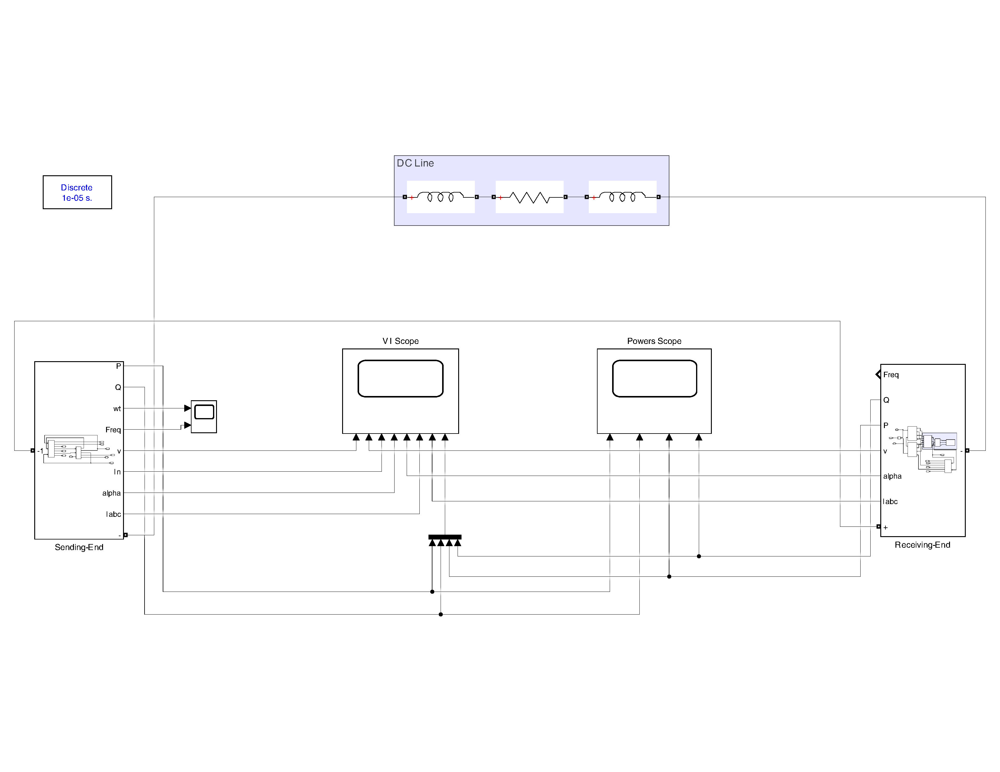
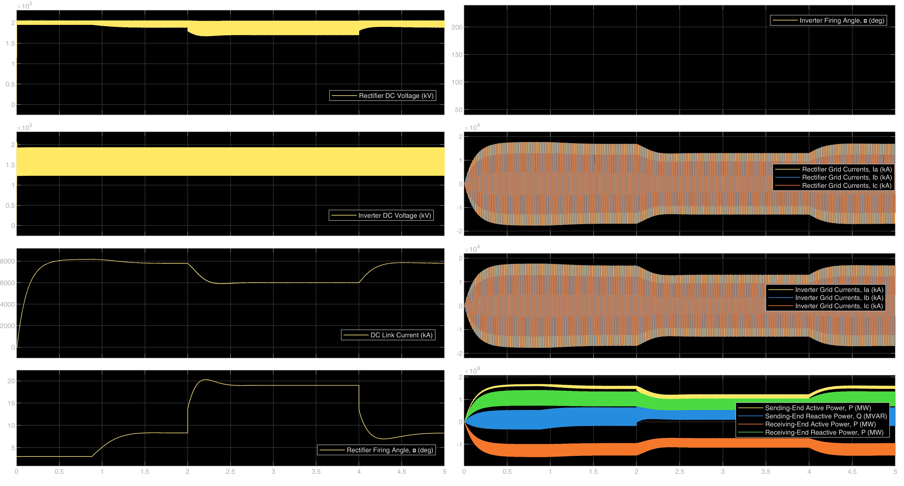
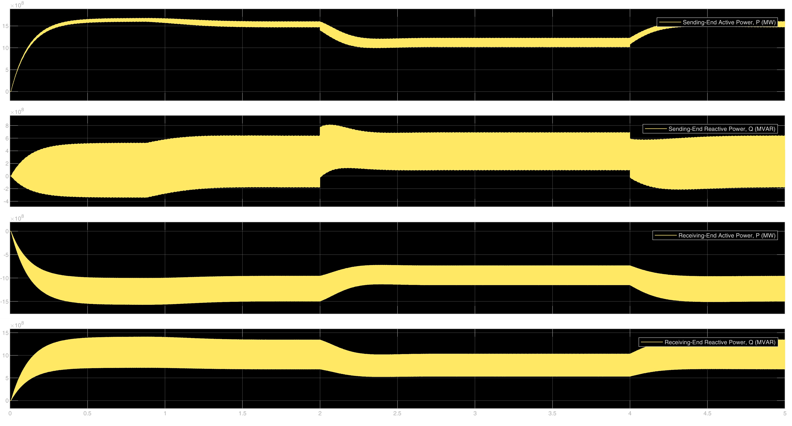
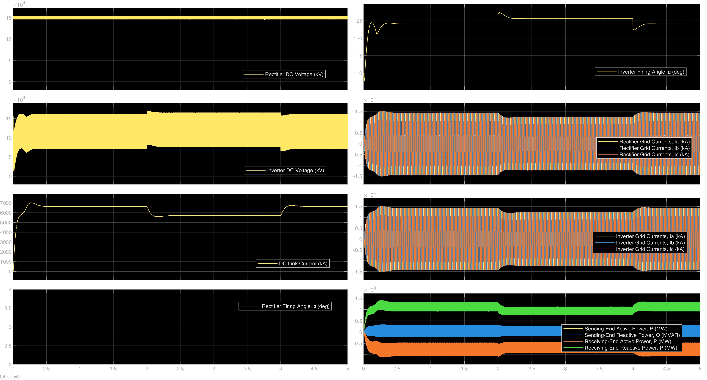
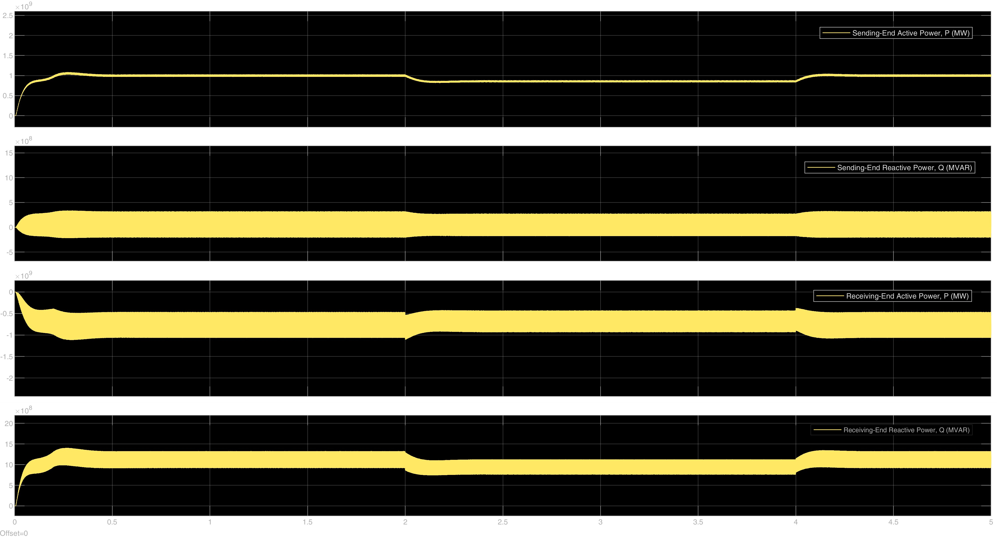

# 12-Pulse LCC-HVDC Transmission System: Control & Fault Analysis

## 🚀 Overview
This repository contains the design, modeling, and simulation of a 12-pulse Line-Commutated Converter (LCC) High Voltage Direct Current (HVDC) transmission system. The project is developed in MATLAB/Simulink and focuses on evaluating the steady-state precision, dynamic reference tracking, and system resilience under normal grid conditions and severe AC voltage sags.

A robust dual-terminal control strategy is implemented, ensuring power continuity and demonstrating advanced fault-ride-through capabilities by employing an automated control handover mechanism during grid faults.

## 🎯 Problem Statement (Project Requirements)
The objective of this project is to model and simulate a **$1.56\text{ GW}$ HVDC transmission link** operating at $+200\text{ kV}$ DC. Power is transferred from Bus A ($50\text{ Hz}$, $75.19\text{ kV}$ rms) to Bus B ($50\text{ Hz}$, $77.618\text{ kV}$ rms) over a DC line with $5\,\Omega$ resistance. The system must be evaluated under two specific scenarios, assuming zero overlap angles:

### Case A: Normal Operating Conditions
*   **Target:** Maintain a Rectifier DC voltage of $200\text{ kV}$ and an Inverter $\gamma$ angle of $40^\circ$.
*   **Control:** Apply Constant Current (CC) control at the rectifier side and Constant Extinction Angle (CEA) at the inverter side.
*   **Dynamic Test:** Show the dynamic performance when the DC reference current steps from $7.8\text{ kA}$ to $6\text{ kA}$ at $t = 2\text{s}$, and returns to $7.8\text{ kA}$ at $t = 4\text{s}$.

### Case B: Severe Sag Condition
*   **Fault:** A $25\%$ voltage sag occurs at the rectifier side.
*   **Control Handover:** The rectifier switches to minimum firing angle (Constant Ignition Angle - CIA, $\alpha_{min} = 3^\circ$). The inverter must take over utilizing Constant Current (CC) control with a current margin of $5\%$ of the rectifier's reference current.
*   **Dynamic Test:** Demonstrate performance while the rectifier reference current changes from $7\text{ kA}$ to $6\text{ kA}$ at $t = 2\text{s}$, then returns to $7\text{ kA}$ at $t = 4\text{s}$.

## 🛠️ Technical Stack & Skills
* **Environment:** MATLAB / Simulink (Simscape Electrical)
* **Topology:** 12-Pulse Thyristor Converters (Y-Y and Y-$\Delta$ transformers)
* **Control Strategies:** Constant Current (CC), Constant Extinction Angle (CEA), Constant Ignition Angle (CIA).
* **Core Concepts:** HVDC Transmission, PI Controller Tuning, Fault-Ride-Through, Harmonic Mitigation, Dual-Terminal Coordination.

## ⚙️ System Performance Analysis

### Case A: Normal Operation
The system efficiently operates under steady grid conditions, successfully tracking dynamic current steps ($7.8\text{ kA} \leftrightarrow 6\text{ kA}$) with fast settling times. The 12-pulse configuration eliminates $5^{th}$ and $7^{th}$ harmonics, ensuring balanced AC grid currents.

| Voltage & Current Dynamics | Active & Reactive Power |
| :---: | :---: |
|  |  |

### Case B: Fault Ride-Through (25% Voltage Sag)
This scenario demonstrates the system's resilience during a severe sending-end fault. The voltage drop forces the rectifier into CIA mode. The automated contingency strategy triggers seamlessly, allowing the inverter to abandon CEA mode and assume CC regulation using the $5\%$ current margin, preventing system collapse.

| Handover Dynamics | Fault Power Flow |
| :---: | :---: |
|  |  |

## 📂 Repository Structure
*   `Simulation/`: Contains the MATLAB/Simulink models (`.slx`) detailing the complete HVDC system wiring and internal control logic for both Case A and Case B.
*   `Docs/`: Contains the final project report with comprehensive mathematical modeling, system specifications, and step-by-step waveform analysis.
*   `Docs/LaTeX_Source/`: Contains the LaTeX source code and associated waveform plots used to generate the report.

## 👨‍💻 Author
**Abd El-Rahman Muhammad Saad Muhammad**
*   **University:** Alexandria University
*   **Department:** Electrical Engineering

---
*Note: This project was completed as part of the HVDC Transmission Systems coursework.*
